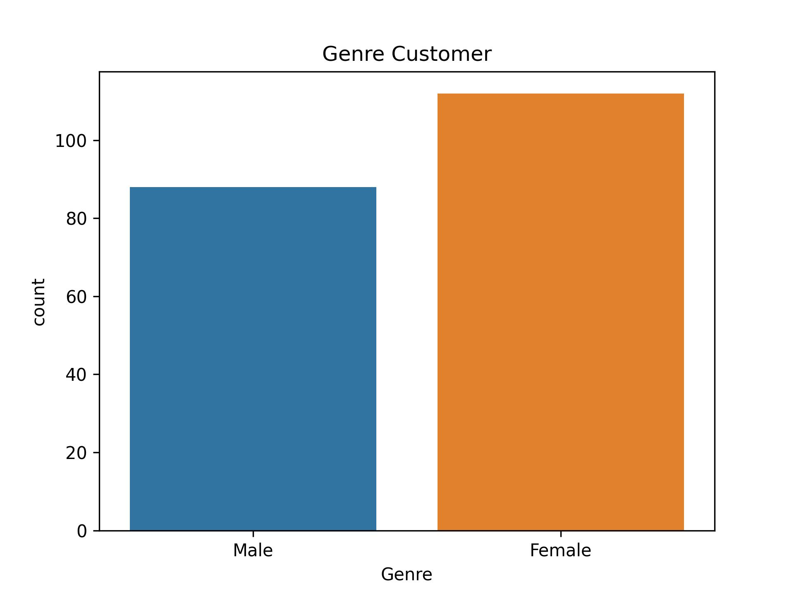
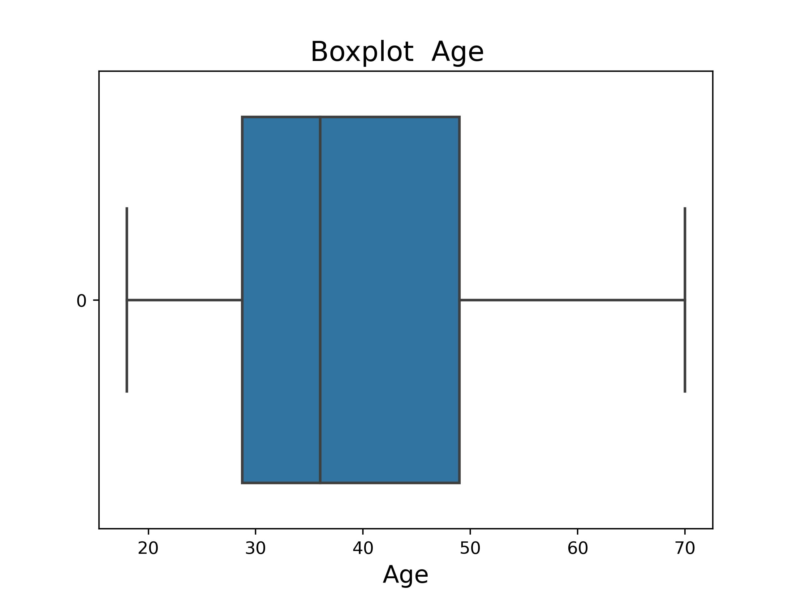
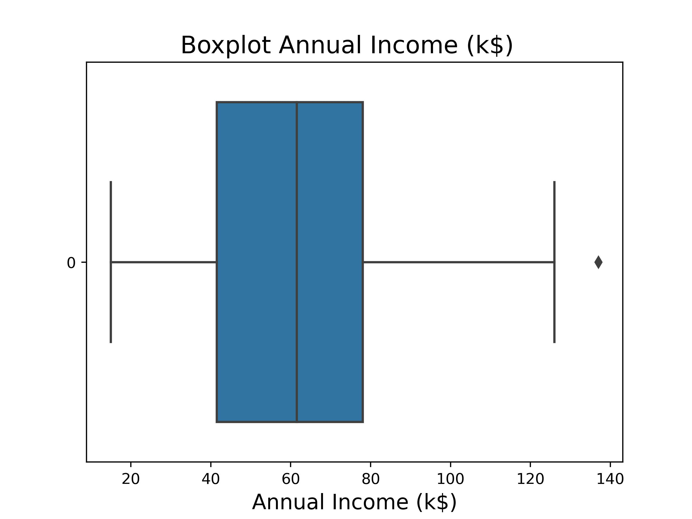
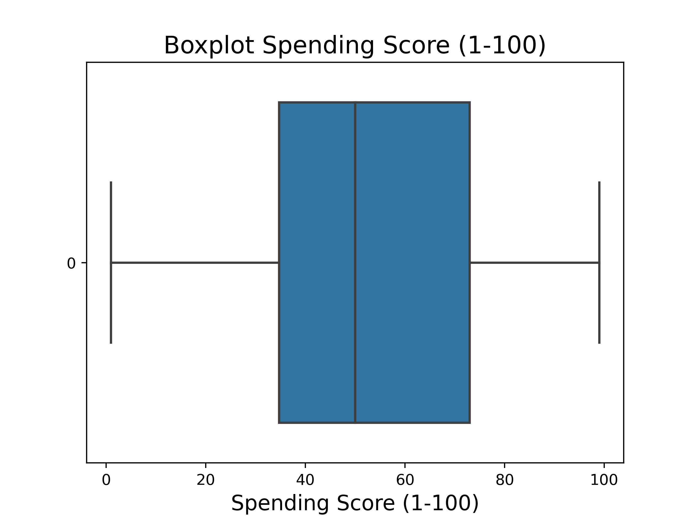
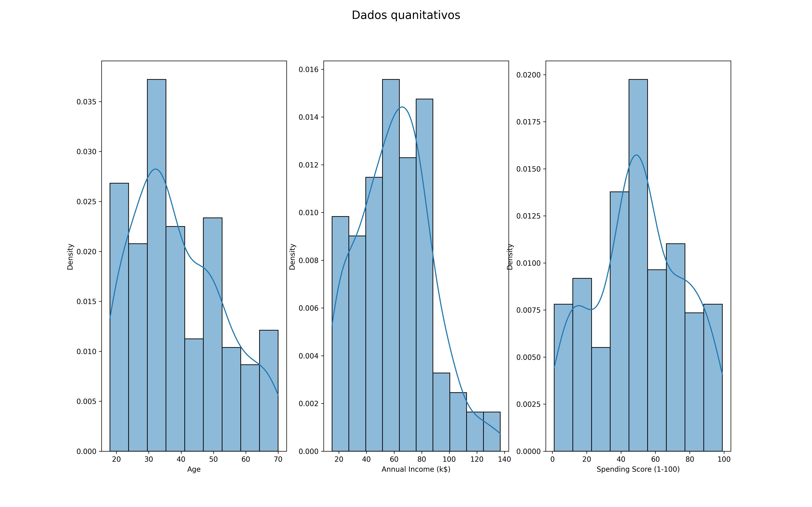
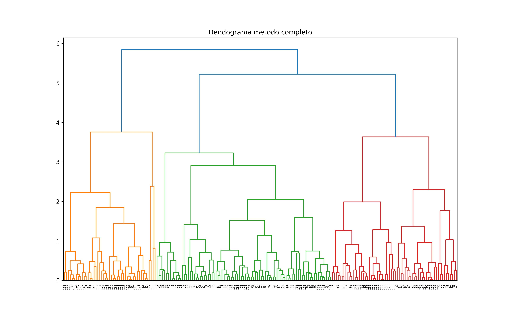
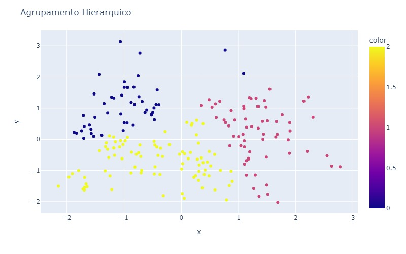
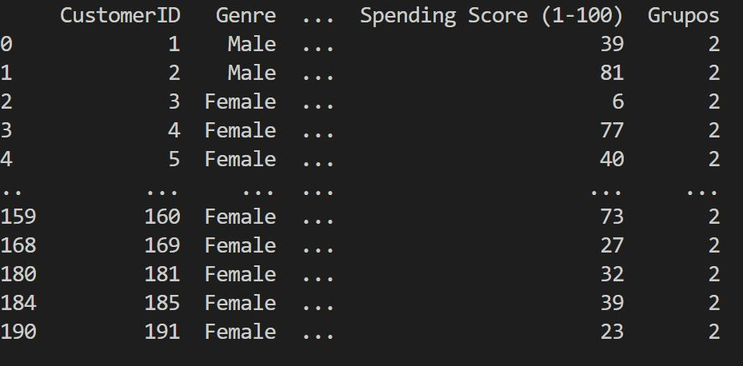

#### 1. Descrição do projeto
 

 Este projeto tem como  objetivo identificar grupos bem definidos de consumidores a partir dos dados de renda, idade, genero e Score. Para a realização do agrupamento foi empregado o algoritmo PCA (Principal component analysis) a fim de selecionar as duas componetes de maior relevancia, em seguida foi empregado o
 algoritmo AgglomerativeClustering da biblioteca sklearn.cluster , com parametros:
 

 * n_clusters=3
 * affinity='euclidean'  
 * linkage='complete'

#### 2. Catalogo de dados

|Dados| Tipo|
|-----|-----|
|CustomerID|int64|
|Genre| object|
|Age|int64|
|Annual Income (k$)| int64|
|Spending Score (1-100)| int64|

#### 3. Exploção de dados

##### 3.1 Contagem por genero

##### 3.2  Boxplot

##### 3.2  Histograma

#### 4 Dendograma

#### 5 Agrupamento hierarquio

#### 6 Resultado com 2 Grupos
